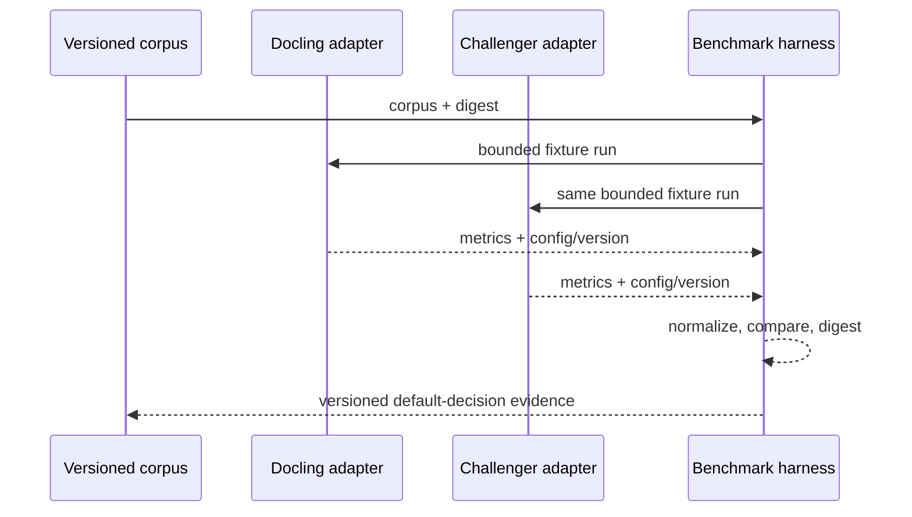
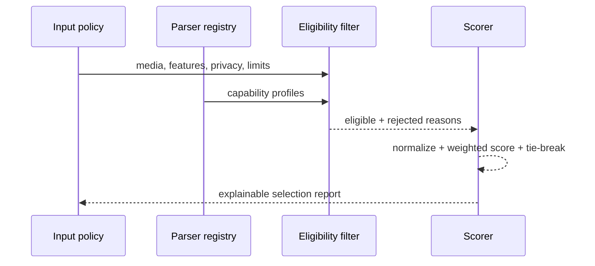
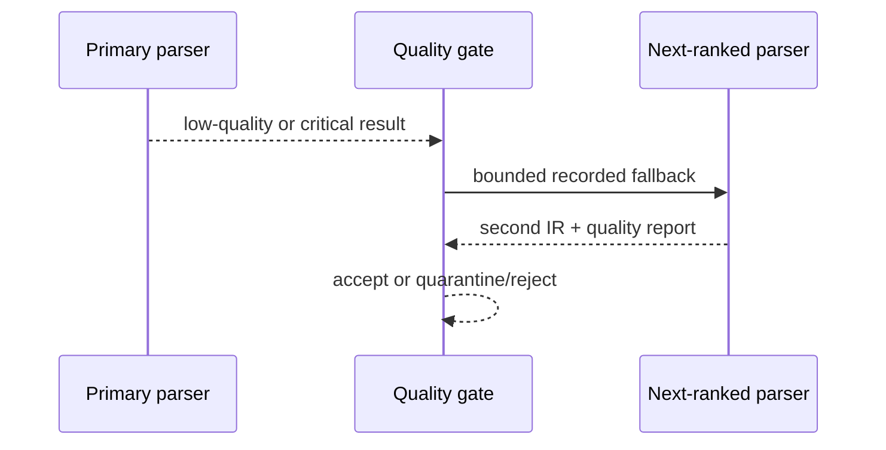
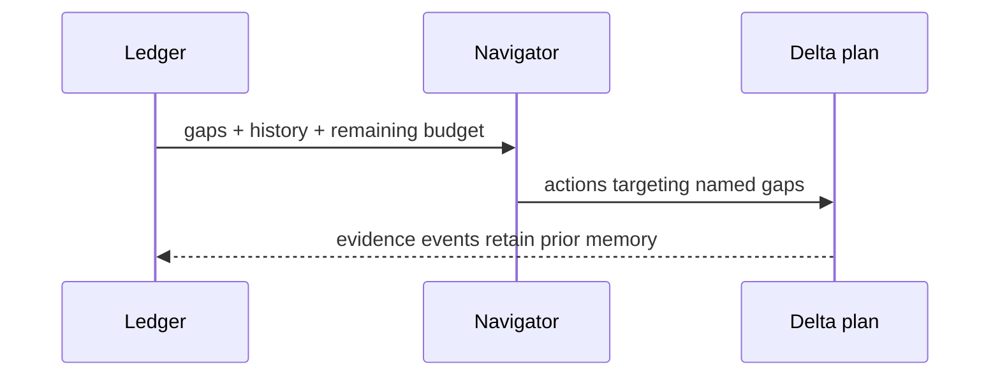
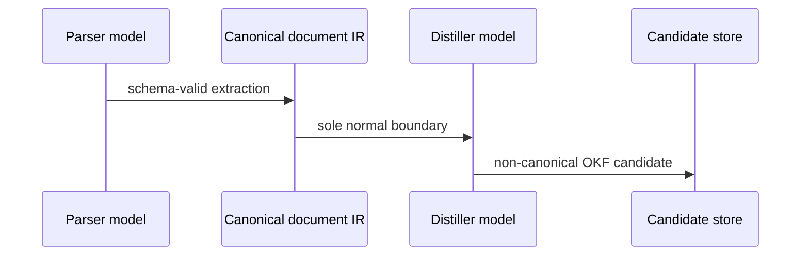
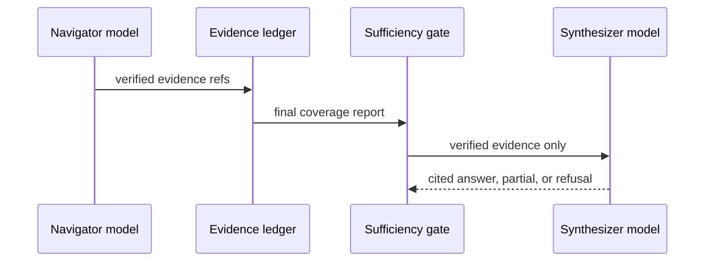
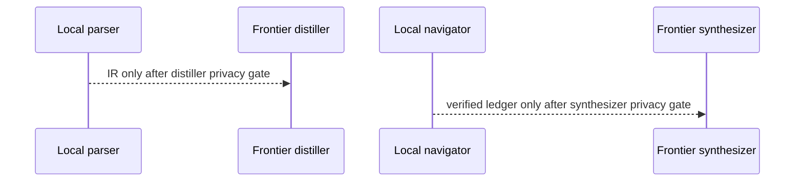
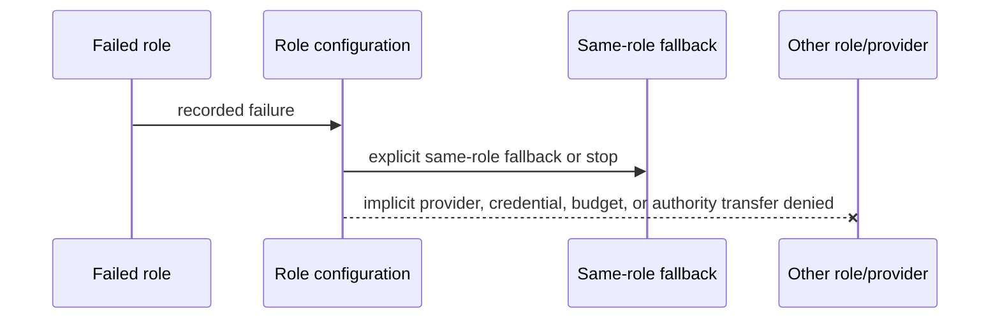

# AO Lore Architecture v0.1

AO Lore extends this template with a local-first, explainable ingestion and
navigation runtime while preserving the repository's existing OKF v0.2 trust
boundaries. `brain/` remains canonical. `sources/` remains immutable evidence.
`working/candidates/` remains non-canonical. No parse, model call, benchmark,
navigation result, or passing score grants promotion, external-action, release,
or publication authority.

## Invariants

- Canonical v0.2 entries remain valid metadata-only history; answerable v0.3
  entries extend the generation format with exact claims and citations.
- Parsing emits canonical document IR and never emits OKF concepts.
- Distillation consumes canonical document IR, never reopens source formats,
  and writes only proposed candidates.
- Default navigation uses canonical knowledge only and never uses embeddings,
  clustering, a vector database, or a graph database.
- Evidence coverage defines navigation success. Depth, nodes, tokens, time,
  and replans are safety ceilings.
- Parser, distiller, navigator, and synthesizer are separate roles even when
  one model implementation is shared.
- Inputs are untrusted data. Validate containment, regular files, bounded size,
  duplicate keys, schema, identities, digests, budgets, and authority flags.
- Traces are explainable and content-minimized; private reasoning is not stored.

## Components and deployment

```text
source -> format detector -> parser registry -> eligibility -> capability score
       -> selected adapter -> canonical document IR -> parse-quality gate
       -> distiller role -> working/candidates/ -> explicit human review

query -> fixed canonical generation replay -> active canonical snapshot
      -> deterministic lexical retrieval -> verified evidence projection
      -> deterministic sufficiency -> evidence-only synthesis
      -> cited answer | qualified partial answer | refusal | investigation
```

Deterministic local implementations are valid role adapters. A mixed deployment
may use local parsing and navigation with separately authorized frontier
distillation or synthesis. Every role has its own provider, model, credential
environment-variable name, network/privacy policy, budget, retry, fallback,
schema, cache, and trace policy. No field inherits across roles.

## Eligibility filtering

Hard eligibility is evaluated before any score. A parser is rejected when it
cannot satisfy the detected media type, required structural features,
document-IR version, privacy/network policy, runtime availability, license,
sandbox, file limit, memory limit, timeout, or other declared resource limit.
Missing evidence for a required capability is rejection, not a neutral score.

The decision report lists every eligible parser and every rejection reason.
It is deterministic for the same registry, policy, document metadata, profile,
and benchmark inputs.

## Capability scoring

Eligible adapters receive a format- and workload-specific selection score:

```text
selection_score =
    weighted_quality_prior
  + required_capability_fit
  + privacy_and_availability_fit
  - expected_latency_penalty
  - expected_memory_penalty
  - expected_external_cost_penalty
```

Each profile declares component direction, normalization bounds, weights,
penalty weights, minimum benchmark samples, missing-optional policy, tie-break
order, and fixture-corpus digest. Values are normalized to `[0,1]` with either
bounded references or robust min/max statistics recorded by the profile.
Non-applicable components are removed and remaining weights are renormalized.
Arbitrary universal weights are forbidden.

Tie-breaking is: required-feature coverage, structural fidelity,
source-location fidelity, deterministic repeatability, lower external cost,
lower latency, then lexical parser ID. Docling is the initial PDF baseline and
has no unconditional priority. Markdown uses a native Markdown baseline; HTML
uses a native structural parser; DOCX uses a dedicated OOXML baseline with no active fallback;
text uses a direct reader. The explicitly activated English OCR path uses the
sealed, qualification-bound `paddle-ocr-english` parser for reviewed scanned
PDF, PNG, and JPEG input. Other OCR languages and optional vision enrichment
remain pending. Each default is a versioned, replaceable conclusion.

## Parser capability profile

Every plugin publishes the machine-readable capability profile in
`schemas/ao-lore/parser-capability-profile.schema.json`: parser identity and
version, media types and extensions, structural elements, native/fallback
status, OCR, layout, tables, links, footnotes, coordinates, images, captions,
languages, offline determinism, frontier need, latency/memory/cost classes,
sandbox/security/license constraints, supported IR versions, and benchmark
references. Unknown fields are retained so plugins can extend the profile.

## Parser benchmark harness

The benchmark harness is isolated from production ingestion. It consumes a
versioned public-safe fixture corpus covering clean digital and degraded PDF,
Markdown, HTML, DOCX, text, and images. Applicable fixtures include headings,
tables, links, code, images, captions, footnotes, coordinates, and multi-column
reading order with reviewed or deterministically generated expectations.

Applicable metrics include character/word accuracy, readable-text coverage,
heading precision/recall/hierarchy, reading order, tables and cells, links,
footnotes, code exactness, caption association, coordinate coverage, IR
conformance, crash/timeout rate, repeatability, p50/p95 latency, peak memory,
provider calls, external cost, and output size. Plain text is not penalized for
layout, and image OCR does not use a Markdown profile.

Each result binds corpus digest, parser/version, configuration digest,
runtime/platform, IR version, shell-free command vectors, raw metrics,
normalized metrics, failures, exclusions, and its canonical result digest.
Defaults and thresholds change only from this evidence.

## Numeric parse-quality gates

The post-run quality score is deliberately distinct from the pre-run selection
score:

```text
parse_quality =
  sum(applicable_component_weight * component_score)
  / sum(applicable_component_weight)
```

Profiles define weights, accept and fallback thresholds, maximum fallbacks,
and calibration-result digest. Components can include text coverage,
structural completeness, reading order, hierarchy, tables, links, code,
captions, source spans, metadata, parser confidence, and IR validity.
Non-applicable components carry `score: null` and are excluded.

Invalid IR, source-digest mismatch, containment violation, unsupported
encryption, crash/timeout, resource breach, no readable content, or lost
provenance is a critical failure independent of the number. At or above the
accept threshold with no critical failure means `accept`. Below the fallback
threshold invokes only the next-ranked eligible adapter while attempts remain.
Profiles decide the intermediate quarantine band. No passing adapter means
`quarantine` or `reject`. Profile version and digest are part of cache identity.

## Canonical document IR and distillation

Parsing owns detection, adapter selection, extraction, OCR/layout recovery,
source spans, document IR, and quality reports. It cannot create knowledge,
assign verification, synthesize claims, or mutate `brain/`.

Distillation owns candidate concepts, claim-to-source mappings, proposed links,
metadata, and contradiction warnings. It accepts only validated document IR.
It has no PDF, DOCX, HTML, OCR, or Docling branches, cannot change parser
scores, and cannot promote candidates. The normal boundary is document IR only.
Legacy ingestion emits metadata-only v0.1 candidates. A batch document may
explicitly supply a closed sensitivity/freshness policy to emit an answerable
v0.2 candidate; its claims and citations are exact copies of bounded IR block
text. Oversized blocks remain mapped metadata and are never truncated into
answer evidence.

## Born-digital PDF and candidate review

The optional `docling==2.118.1` adapter accepts only bounded
`application/pdf` bytes through Docling `DocumentStream`. It configures a
PDF-only converter, sets `do_ocr=False`, caps input bytes, pages, and output
blocks, and translates Docling objects into primitive canonical-IR blocks.
URLs, arbitrary source paths, partial conversions, empty output, version
drift, configuration drift, and benchmark failures are rejected. External
errors are reduced to stable categories before they cross the adapter boundary.

Production registration requires a self-digesting benchmark manifest for the
exact package version, corpus, and configuration. Reliability and deterministic
repeatability must equal 1.0; structural, text, and source-location fidelity
must meet their declared minimums. Calibration uses an explicitly unqualified
adapter and cannot activate production parsing. Model artifacts and benchmark
reports remain ignored beneath `.ao-lore/`; the tracked corpus contains only
deterministic public-safe PDF bytes, expectations, and generator code.
The shipped `limited-pdf` challenger extracts simple PDF text literals and
runs through the identical calibration path, demonstrating that parser
identity does not select the winner. Fixture applicability is explicit;
metrics with no applicable fixtures are emitted as exclusions and are not
silently scored as zero.

Accepted IR can be distilled in memory and passed to the candidate store with
pure, recomputed provenance bindings. Persistence atomically renames a private
temporary directory into `working/candidates/<candidate-id>`, is idempotent
only for exact existing content, and rejects containment, link, file-type,
identity, or digest drift. Reviews are immutable exclusive JSON events with
contiguous sequence numbers, candidate binding, previous-event digest, and
self-digest. Inspection verifies the full chain and projects only review state.
It never changes the stored candidate or grants canonical promotion authority.

The production ingest surface accepts exactly one contained, regular,
born-digital PDF beneath `sources/`. It loads the qualified manifest from
`$AO_LORE_HOME/benchmarks/docling-2.118.1.json`, binds the exact source,
selection report, quality report, document IR, distillation trace, candidate,
and provenance digests, and automatically persists the non-canonical result.
An exact retry retains the original provenance `created_at`; any semantic or
digest contradiction fails closed. Ingestion does not use OCR, reopen the
source during distillation, or mutate `brain/`.

The candidate queue is a read-only projection over the bounded on-disk
collection, not a database or mutable index. Before returning any page it
enumerates and verifies the whole collection, including regular-file and link
constraints, candidate/provenance identities and digests, and every review
event. Results are ordered by `(created_at, candidate_id)`. An `after` value is
an exclusive candidate-ID cursor, and `next_after` identifies the last scanned
candidate only when more candidates remain. The CLI calls the default
`unreviewed` projection `pending`; accepted and rejected projections remain
explicit. Corruption anywhere prevents a partial or misleading queue result.
Human output escapes control characters and omits sensitive candidate content;
JSON output is the strict automation surface.

## Governed candidate promotion boundary

Candidate review and canonical promotion are separate state machines and
separate authorities. AO Lore exposes fixed `promotion prepare`, `apply`,
`inspect`, `rollback`, and `recover` actions. The public parser accepts no
caller-selected brain, candidate, runtime, source-head, failpoint, network,
force, conflict, concurrency, or authority-bypass controls.

Preparation holds the global promotion lock while descriptor-verifying the
candidate, complete review chain, source head, canonical brain inventory, and
collision state. It writes only an exclusive proposal and append-only audit
events beneath the repository-owned runtime root. An accepted review or a
prepared proposal does not authorize canonical mutation.

Apply requires a separately supplied strict, expiring, one-use authorization
whose exact proposal, candidate, provenance, review head, source head, prior
brain inventory, expected generations, and write set all revalidate under the
global lock. Before mutation it durably reserves that authorization. It stages
one complete generation, fsyncs it bottom-up, and publishes it with
descriptor-anchored Linux `renameat2(RENAME_NOREPLACE)`. Immutable transaction,
authorization-consumption, recovery, and digest-chained audit records bind the
result. Candidate bytes remain non-canonical and unchanged.

Rollback is not deletion or history rewriting. It derives a strict rollback
proposal and requires a different one-shot rollback authorization, then appends
a zero-entry restoration generation through the same locked durable protocol.
Inspect independently derives state without mutation. Recovery holds the
global lock across classification and exact resumption; it cannot invent
authorization, delete foreign state, or reinterpret conflicting evidence.
Candidate review append uses the same global lock before its candidate-local
lock, so reviews and promotion snapshots cannot race.

The implementation campaign ran prepare, apply, inspect, rollback, and recover
only against campaign-created public-safe disposable fixtures. No existing or
private candidate was inspected or promoted, and canonical repository
`brain/` bytes remained unchanged. Control availability, acceptance, proposals,
tests, audits, readbacks, or recovery classification grant no live-operation
authority. Each live promotion and rollback needs its own explicit bounded
authorization. Provider, network, credential, batch, overwrite, unattended,
publication, release, deployment, and authority-advance permissions remain
outside this boundary.

## Canonical generation reader and answer boundary

The canonical reader is a fixed-root, descriptor-coherent projection over
`repository_root()/brain/generations`. It is not a general repository search
service. Production callers cannot select a brain, candidate store, generation,
index, model, provider, network policy, cache, clock, trust policy, or budget.
The reader holds no-follow descriptors, bounds and strictly validates every
manifest and entry, requires a contiguous generation history, and replays
`add` and nested `restore` transitions exactly. Symlinks, forbidden hardlinks,
special files, identity drift, sequence gaps, digest contradictions, ambiguous
restores, unsupported active versions, or snapshot replacement fail closed.

The knowledge lifecycle has intentionally non-interchangeable stages:

```text
immutable source -> canonical document IR -> non-canonical candidate
                 -> accepted candidate -> separately authorized promotion
                 -> immutable canonical generation -> effective active snapshot
                 -> retrieval hit -> verified evidence -> gated answer
```

Source bytes authorize no claim. Document IR is parser output, not knowledge.
A candidate is proposed distilled knowledge, and review acceptance records a
human decision without promoting it. Accepted candidates are never opened by
status, search, or answer. Promotion may append a canonical generation only
under its separate one-shot authorization. Canonical history alone does not
make an entry active: exact generation replay determines the effective
snapshot, and restoration can remove later entries from that snapshot without
rewriting history.

Canonical v0.2 entries are replay-compatible metadata-only records. Their
concept titles may appear in search only with `metadata_only` classification;
they have no answer-time claim, evidence ID, or canonical citation and are
never evidence. Canonical v0.3 entries preserve the provenance envelope and
add exact bounded claims, citations, and immutable sensitivity/staleness
policy. Active v0.3 claims alone can become answerable search hits.

The public search projection omits restricted v0.3 entries before claim or
citation material is rendered. Eligible public and internal projections still
must pass the independently derived trust and freshness gates before they can
support an answer.

Search normalizes with Unicode NFKC and case folding, converts non-alphanumeric
runs to spaces, and ranks exact/substring and lexical token overlap with stable
identity tie-breaks. The in-memory projection is rebuilt from the coherent
snapshot and is never written to disk. There are no embeddings, vector or
graph database, probabilistic score, model reranking, provider call, network
access, credential use, or query cache. Search preserves distinct conflicting
and qualifying claims as distinct hits; it does not synthesize consensus.

An answer request creates one fixed evidence requirement and projects ranked
active claims into exact evidence IDs bound to generation, manifest, entry,
claim, citation, source, document-IR, provenance, and accepted-review digests.
Freshness and trust are derived at read time. The navigator's existing
mandatory coverage, provenance, citation, freshness, trust, contradiction,
and deterministic-validation gates remain authoritative. Retrieval is only a
candidate evidence projection; verified evidence is only a projection that
passes its exact bindings; an answer is only evidence-ledger synthesis after
the final gates. A hard contradiction produces refusal rather than merging
claims. Insufficient but usable evidence can produce a bounded partial;
invalid or drifting canonical state produces investigation.

The public surface is exactly:

```text
ao-lore knowledge status --json
ao-lore knowledge search --query <text> [--limit <1-200>] --json
ao-lore knowledge answer --query <text> --json
```

Status distinguishes `empty`, `legacy_only`, `mixed_version_partial`, and
`fully_answerable`. Answer returns only `answer`, `partial`, `refuse`, or
`investigate`. Requests, result counts, generation/entry/restore traversal,
claims, citations, ledger items, readbacks, and answer bytes are all bounded;
the fixed answer ceilings are 200 nodes, eight replans, 60 seconds, 100,000
estimated tokens, and 32 KiB of answer text. Query-derived state is never
persisted, and ordinary CLI failures cross one content-free redaction boundary.

The canonical-reader campaign used deterministic public-safe disposable
source, IR, candidate, authorization, generation, and query fixtures. It did
not inspect the default candidate store or canonical brain, execute a real
canonical query or live promotion, contact providers or networks, use
credentials, publish, release, deploy, or advance authority. Local deterministic
read-only capability and passing fixture gates do not authorize real canonical
use. Real use, live promotion or rollback, provider activity, release,
publication, and deployment remain separate operator-authorized actions.

## PDF corpus and resumable batch ingestion

The deterministic public PDF corpus covers multi-page hierarchy, two-column
order, tables, Unicode, links, footnotes, repeated headers and footers, long
boundaries, and explicit empty, truncated, encrypted, and image-only rejection
cases. Expected failures remain first-class evidence and are excluded from
accepted-only reliability denominators rather than hidden or scored as zero.
`generate.py --check` binds every tracked fixture byte. An optional private
calibration boundary emits only aggregate metrics, counts, exclusions, stable
failure counts, and opaque digest bindings; it never emits private locators,
filenames, content, or exception strings.

Batch ingestion composes the single-document service; it does not duplicate
parsing, quality, distillation, provenance, candidate persistence, or review.
A strict repository-contained manifest binds 1 through 100 documents by order,
item ID, `sources/` locator, source digest, and optional per-PDF answerability
policy. Policies are detached per document before being passed to the
distiller, so they cannot bleed across batch items. The service uses the exact
manifest-bound Docling qualification and profiles, executes sequentially, and
maps safe document failures to a closed public error-code set. Unexpected
internal failures abort without fabricating a terminal item.

Each terminal transition atomically replaces a self-digesting checkpoint below
`$AO_LORE_HOME/batches/<batch-id>/`. Directory and file operations use held,
no-follow descriptors and verified reopen; checkpoint history, counts, order,
manifest binding, candidate/provenance binding, and false authority constants
must all agree before resume. A terminal final readback is derived only from
that verified state. An exact rerun skips terminal documents and returns the
same aggregate. A post-candidate/pre-checkpoint interruption safely re-enters
single-document idempotency. Rejected documents are retried only through a new
manifest and batch ID.

The CLI exposes only `ingest-batch --manifest <repository-relative.json>
[--json]`. It loads the exact qualification manifest from the contained runtime
home, renders and validates the complete result before one stdout write, and
reduces allowed failures to one stable path-free error. Human output contains
only aggregate counts, item IDs, stable statuses/codes, candidate IDs, and safe
candidate commands. OCR, concurrency, mutable retry, root, parser, and
checkpoint overrides do not exist. Batch completion, candidate review, and
candidate promotion remain separate states and authorities.

### Fixed-root private PDF operator evidence

`scripts/private-pdf-uat.py` is a repository-local operator harness, not a new
public `ao-lore` command. Its only actions are `prepare-seed`, `run`, and
`cleanup`, each with optional canonical JSON output. Argument parsing precedes
the lazy product import. There are no caller-selected sources or roots and no
parser, OCR, provider, network, concurrency, retry, review, promotion, or
threshold controls. Each action validates the complete service result and
stages a content-free rendering before one stdout write; every ordinary
failure collapses to one stable rejection while process-control exceptions
retain their normal meaning.

Intake is limited to four reviewed public Ubuntu package documents and never
discovers arbitrary files. Bytes, bounded annotations, detailed calibration,
and execution evidence stay under ignored
`$AO_LORE_HOME/calibration/private-pdf/` and
`$AO_LORE_HOME/uat/private-pdf/` roots. Terminal evidence has a separate,
non-cleanup-owned root at
`$AO_LORE_HOME/evidence/private-pdf-uat/<batch-id>/`. Each terminal directory
contains exactly the canonical readback and a cleaned-state record. The
exported aggregate is limited to
metrics, exclusions, stable failure counts, latency, peak memory, and
repeatability plus closed counts/status and false authority fields. Operator
rendering exposes only opaque identity, status, and counts.

The qualified model cache is an intake source, not a live worker dependency.
Intake holds a no-follow root descriptor, bounds depth, entry count, per-file
and total bytes, rejects unsafe links, hard links, and special files, and hashes
every logical model/blob file into a deterministic tree manifest. It then
builds and fsyncs a random run-owned cache with all links dereferenced and all
write bits removed. Prepared-run, worker, calibration, and cleanup evidence
bind its root identity, tree manifest/digest, file count, and byte count. Both
consumers verify the tree before and after use.

Ingest workers also require an OS-enforced Ubuntu bubblewrap sandbox. The
worker contract binds the absolute mechanism, observed version, exact argv,
network namespace, mount targets and device/inode identities, environment, and
sealed-cache identity/digest. `/` starts empty and receives only fixed
read-only system, Python, and repository mounts; `/tmp` is private, the
network namespace is unshared, and host runtime/control paths and filesystem
Unix sockets are absent. Only the run-owned worker state, exact batch state,
and noncanonical candidate root are writable. The sealed cache and all source,
qualification, code, and repository paths remain read-only. Parent and worker
also bind any active interpreter dependency root outside those fixed mounts as
an explicit read-only, socket-free mount. `PYTHONNOUSERSITE` disables ambient
discovery; the cleared environment names only the contract-listed roots.
Both processes validate the same contract; a missing probe, changed mount, changed
environment, or failed worker phase cannot support a trusted no-network
readback. The process-group interruption and bounded descendant termination
operate through the bubblewrap launcher.

Private calibration uses a distinct internal worker rather than loading
Docling in the operator process. Its bubblewrap contract preserves the same
empty allowlisted root, private `/tmp`, unshared network namespace, sealed-cache mount,
and cleared environment while exposing only the exact run-state directory for
the atomic aggregate result. The contract additionally binds the ordered
private manifest, source identities/digests/sizes, qualification bytes and
result, configuration, cache tree, output parent, per-item deadline, and a
200 MiB aggregate source ceiling. Parent verification requires a zero-output
worker, an unchanged sealed cache, an exact result digest, and explicit
sandbox/network isolation evidence before `network_accessed=false` can be
projected. All descendants receive bounded TERM/KILL cleanup on timeout or
failure, and transient calibration contract/result files are removed after
verification.

The run composes the real sequential batch service. Preparation first completes
only exact digest-bound orphan cleanup and stages verified bytes. It then
snapshots `brain/` and the candidate set, revalidates the prepared artifacts,
and starts an OCR-disabled offline
worker, observes a verified checkpoint, sends one controlled interruption,
resumes the exact manifest, and performs an exact completed rerun that must add
zero conversions. A descriptor-held conversion journal accounts for actual
calls across all three phases. A socket guard remains active for the worker's
full lifetime. Candidate-queue bindings and the first post-run `brain/` digest
must agree before cleanup begins. Cleanup must complete, and a second
post-cleanup `brain/` snapshot must still equal the baseline, before the
terminal readback is even assembled.

Temporary repository staging and isolated UAT candidate/batch state are
verified and removed before terminal publication. The readback and cleaned
state are written into an unpublished sibling directory, strictly reloaded,
and atomically renamed into place; the cleaned state binds the readback digest,
batch/corpus identities, and the three equal brain digests. Cleanup has no
evidence-root allowlist entry. Legacy retained readbacks remain read-only
loadable, while all new writes use the two-file canonical root. Process-loss
recovery uses only digest-bound harness records. Seed cleanup serializes cooperative writers,
revalidates held descriptor bindings, and rejects drift; its final unlink has
the documented Linux limitation that another same-UID writer must not replace
the verified name in the last unobservable syscall window. This operational
constraint is not promotion or authority.

The four-document seed can derive only `hold` or `investigate` and cannot
mutate product thresholds. A separately reviewed representative-domain corpus
uses the same ignored recovery, worker, calibration, cleanup, and evidence
boundaries; only that origin may additionally derive `candidate_change` for a
repeatable below-floor fidelity weakness. Exact non-skipped seed
offline execution recorded four successful documents, no rejection, one
controlled interruption, three resumed conversions, zero rerun conversions,
and `hold`; its path-free aggregate digest is
`sha256:dafeecc62751f2ea165948f9c169a9d31b50580eb7fbeadd55309b2165c4836e`.
The representative-domain execution independently recorded conversions
`1/3/0`, two identical calibration runs, `hold`, origin digest
`sha256:aeb6bd753c370f5afbe7556d57a92c986a9b87d7dac83fd056d3bb5468ebc54d`,
and aggregate digest
`sha256:4008ffc713e72c7a1c29ad628c84d5b1c8455d6818a7aced96ceb52e0590611d`.
Its text, structural, and source-location fidelity scores were `0.5`, `1.0`,
and `1.0`; no exclusions or stable failures were retained. Source and brain
digests were unchanged and all transient derived corpus, staging, candidate,
and batch state was removed.
Unreviewed candidates remain non-canonical, and this harness does not review,
promote, contact providers or networks, release, publish, or deploy.

## Evidence coverage

After classification, the planner emits stable evidence requirements with a
criterion, importance weight, evidence type, lifecycle/freshness condition,
minimum derived OKF trust tier when applicable, citation/provenance rules,
mandatory flag, and status.

Requirement states are `satisfied`, `partially_satisfied`, `missing`,
`contradictory`, `stale_only`, and `disqualified`. A versioned query profile
maps them to satisfaction values; satisfied is `1`, hard-unsatisfied states are
`0`, and partial uses a declared value strictly between them.

```text
evidence_coverage =
  sum(requirement_weight * satisfaction_value)
  / sum(requirement_weight)
```

Coverage is not OKF trust, parser confidence, model confidence, or answer
correctness. Successful stopping requires the target, all mandatory
requirements, provenance, citations, freshness, trust, no unresolved hard
contradiction, and deterministic validation. Reaching maximum depth never
proves completion; the result must replan, become partial, or refuse.

Branches are prioritized by expected uncovered requirement gain divided by
estimated traversal cost. After each evidence event the ledger and coverage
history update, high-weight gaps are identified, low-yield branches are pruned,
and the navigator either stops or emits a gap-specific delta plan. Replanning
preserves visited nodes, gathered evidence, rejected branches, all plan
versions, coverage history, and remaining budgets.

Traces include initial requirements and weights, every coverage event and gain,
gaps, chosen branches, target, final result, nodes per satisfied requirement,
evidence yield, tokens per coverage point, traversal after sufficiency,
no-gain replans, and the highest-weight unresolved requirement.

## Model-role separation

### Parser role

Optional for OCR, layout, handwriting, ambiguous tables, and bounded quality
enrichment. It receives only the source or bounded regions and parser context,
emits parser/IR schema output, and cannot create knowledge, navigate, answer,
promote, or alter policy. Native deterministic parsers remain valid.

The English OCR parser is exposed only by explicit retained-evidence
activation. Qualification keeps outcome correctness separate from
repeatability: both attempts hash the same semantic result without injecting
the attempt number. A repeatable nonselected fidelity or closed-outcome
weakness yields `candidate_change` when another candidate passes every gate;
disagreement, an unclassified adapter failure, security/resource drift, or no
passing candidate yields `investigate`. Activation from reviewed
`candidate_change` evidence independently recomputes the closed winner,
requires the selected hard pass and all candidate results to be repeatable,
and rebinds runtime, corpus, oracle, configuration, model, qualification, and
selected-result digests. The decision itself never mutates a parser profile.

`QualifiedOcrAdapter` is the sole production bridge from that activation to a
sandboxed worker result. It rechecks the candidate, runtime, model, worker
configuration, and all false authority fields before canonicalization. The
single-document OCR ingress accepts only descriptor-verified PNG, JPEG, or PDF
bytes and an exact activation. Scanned-PDF batches use the closed v0.3 manifest
identity (`ocr`, `application/pdf`, `paddle-ocr-english`, `0.1.0`) and cannot
select a backend or model. Both paths preserve the existing distillation,
candidate persistence, checkpoint, queue, and human-review boundaries; their
readbacks remain noncanonical and grant no promotion authority.

The private OCR operator is a lazy fixed-action facade. Argument validation
precedes product imports, each action calls one product service, the complete
result is detached under one aggregate budget, and output is rendered before
one exact write and flush. Ordinary service or stream failures collapse to a
single content-free rejection; process-control exceptions propagate. The
operator does not accept locators, model names, runtime roots, device choices,
providers, retries, concurrency, or thresholds.

The exact representative OCR campaign completed with 1 initial, 3 resumed,
and 0 rerun conversions. All four reviewed PDFs produced candidates, none were
rejected, every item calibrated twice with identical results, and the decision
was `hold`. The brain digest agreed before work, after work, and after cleanup.
Cleanup retained exactly the validated readback and cleaned-state files with
byte digests
`sha256:c84108676f20b3703dcdc7ada4265e53198027bde2a53fcf883fd33bbebb28ad`
and
`sha256:e8395e18fb970438b33640320646b9192b02bd4e6c719fe862b7da5de947344a`.
Recursive privacy, source immutability, and residue checks passed. Qualification,
activation, and retained UAT evidence grant no promotion, release, publication,
or deployment authority; network and provider use remain false.

### Distiller role

Consumes canonical document IR and explicit candidate comparison context.
Emits candidate concepts, provenance mappings, links, metadata, contradictions,
and a trace. It cannot reopen sources, call parsers, browse canonical knowledge,
synthesize the final answer, or promote.

### Navigator role

Consumes query, compact canonical routing metadata, visited memory, ledger
summary, coverage gaps, and budgets. It emits only schema-valid plans, actions,
and assessments. It cannot mutate OKF, change parser output, promote, issue the
final prose answer, or bypass deterministic sufficiency.

### Synthesizer role

Consumes only the normalized query, verified ledger entries, final coverage
report, answer format, and citation/qualification requirements. It cannot
browse, replan, add evidence, parse, or change trust/freshness/coverage. An
insufficient ledger requires the prescribed partial or refusal form.

### Configuration, cache, fallback, and trace

Every role independently declares adapter, provider, endpoint, model ID,
policy version, output schema, context/output limits, decoding, timeout,
retries, network/privacy policy, token and monetary budgets, fallback, cache,
and credential environment-variable name. Fallback is explicit and role
scoped. A local navigator failure cannot send documents to a frontier parser.

Cache identity is role, model ID, provider, policy version, input digest,
output schema version, and configuration digest. Traces record role,
adapter/model identity, input/output digests, schema, tokens, latency, retries,
fallback, and redacted error state. Private reasoning is never persisted.

## Role authority and privacy matrix

| Role | Normal input | Output | Network default | Forbidden authority |
| --- | --- | --- | --- | --- |
| Parser | Source or bounded regions | Document IR | Offline | Knowledge creation, answering, promotion |
| Distiller | Canonical document IR | Non-canonical candidate | Offline | Source reopening, parsing, promotion |
| Navigator | Canonical routing metadata and ledger | Plans/actions/assessments | Offline | Mutation, final answer, sufficiency bypass |
| Synthesizer | Verified evidence and coverage | Answer/partial/refusal | Offline | Browsing, replanning, evidence changes |

## Required sequence diagrams

### Docling versus challenger benchmark



### Eligibility filtering and capability scoring



### Primary parse passes quality gate

```mermaid
sequenceDiagram
  participant S as Selector
  participant P as Primary parser
  participant Q as Quality gate
  participant D as Distiller boundary
  S->>P: selected input
  P-->>Q: document IR
  Q-->>Q: numeric score; no critical failure
  Q-->>D: accept validated IR
```

### Primary parse invokes fallback



### Coverage reached before depth

```mermaid
sequenceDiagram
  participant N as Navigator
  participant L as Evidence ledger
  participant G as Deterministic gate
  N->>L: evidence-bearing node
  L-->>G: target met before depth ceiling
  G-->>N: stop; synthesis allowed
```

### Depth exhausted without coverage

```mermaid
sequenceDiagram
  participant N as Navigator
  participant B as Budget gate
  participant L as Evidence ledger
  N->>B: maximum depth reached
  L-->>B: insufficient coverage
  B-->>N: delta replan if budget remains; otherwise partial/refusal
```

### Coverage-gap delta replan



### Parser to IR to distiller



### Navigator to ledger to synthesizer



### Mixed local and frontier deployment



### Role failure without cross-role fallback



### Fixed private DOCX operator campaign

The private DOCX operator is a repository-local, standard-library shell over
the native OOXML campaign services. It parses before importing product code,
accepts only `prepare-seed`, `run`, and `cleanup` with optional canonical JSON,
and makes one state-changing product call for the selected action. The complete
service result is bounded, detached into exact built-in values, validated, and
reduced before one output write and flush. Ordinary argument, product,
validation, serialization, write, or flush failures collapse to the stable
path-free rejection; process-control exceptions propagate.

```bash
AO_LORE_HOME="$PWD/.ao-lore" PYTHONPATH=src python3 scripts/private-docx-uat.py prepare-seed --json
AO_LORE_HOME="$PWD/.ao-lore" PYTHONPATH=src python3 scripts/private-docx-uat.py run --json
AO_LORE_HOME="$PWD/.ao-lore" PYTHONPATH=src python3 scripts/private-docx-uat.py cleanup --json
```

The fixed corpus identity and four opaque item identities cannot be overridden.
Reviewed inputs carry both original and derived digests and the exact
`restore-ooxml-local-header-v1` transformation, which changes only the damaged
four-byte local-header signature. Native OOXML validation rejects unsafe ZIP
structure, relationship escapes, external or active content, unsupported XML,
and resource overflow before IR extraction. The representative policy measures
88 accepted documents, 11 expected active-content rejections, and one expected
invalid-package rejection for an unowned opaque package part. DOCX page
counts remain unavailable rather than being synthesized.

The inactive package allowlist is role- and owner-specific. It includes
styles-with-effects, custom properties, JPEG thumbnails, glossary parts,
diagram suites, comments metadata extensions, people metadata, and obfuscated
fonts only at their exact names, content types, XML roots or bounded binary
signatures, and internal relationship owners. These parts contribute only to
the immutable package inventory. External targets are limited to hyperlinks
and are never fetched; unknown, orphan, executable, or mismatched role suites
fail closed before IR extraction.

The representative compatibility layer does not perform general URI or XML
repair. It removes exactly one leading slash from package-root internal
targets, permits one exact empty leading `mso-contentType` processing
instruction only in custom XML datastore items, and caps aggregate XML text at
29,360,128 characters while retaining a 25,165,824-character cap for each XML
part. Custom XML item properties permit zero or one `schemaRefs` container; a
present container has no attributes and is either empty or contains unique,
nonempty URI-only leaf entries. External image targets must match the bounded `cid:`
grammar and be referenced only by `r:link`; validation discards the target and
IR retains only the external-image classification. Four comments metadata
content-type aliases remain bound to their exact roles. Note, endnote, and
numbering relationship parts, glossary styles-with-effects, and EMF/JPEG
thumbnail bodies have closed owner, target, signature, and terminal-padding
checks.

Preparation, execution, calibration, retained evidence, and cleanup use
digest-bound intents, held directory/file identities, no-replace publication,
fsynced state, deterministic recovery quarantines, and exact ownership checks.
The reviewed 100-document qualification set is published by one product-owned
transaction at `private-docx/qualification-inputs`: its closed manifest binds
ordered descriptor identities, original and derived sizes and digests, the
single four-byte transformation, and the validated expectation digest. The
qualification result remains at `private-docx/qualification.json`; the
four-item UAT corpus remains at `private-docx/corpus`. Validated coexistence
propagates the representative expectation digest into UAT provenance, while
cleanup reclaims only exact product-owned inputs and preserves the result.
Fixed intent and staging names bound partial preparation and recovery; unknown
or drifted nodes fail closed. The final filesystem syscall boundary assumes
the already documented exclusive cooperative writer and grants no authority.
The exact benchmark execution seam calls the preparation transaction exactly
once, gives the adapter factory a detached manifest, reloads the published
expectation and fixtures, and checks their representative digest plus every
derived size and digest before calibration. It has no independent input writer
and does not widen the public CLI.
Ingest and calibration workers run in distinct bubblewrap processes with an
empty allowlisted root, read-only sources and code, only exact run-owned writable
state, a private temporary directory, an unshared network namespace, a cleared
fixed environment, resource ceilings, and clone/fork denial. The parent verifies
process status, bounded output, journals, checkpoints, conversion arithmetic,
candidate bindings, unchanged `brain/`, calibration repeatability, and cleanup
before retaining terminal evidence.

The public projection contains no private paths, filenames, package entries,
text, relationships, exceptions, runtime locators, or digests. It reports only
fixed identities, lifecycle/counts, cleanup status, the closed tuning decision,
and false OCR/network/provider/promotion/authority fields. The decision is only
`hold`, `candidate_change`, or `investigate`; it does not grant qualification or promotion authority.
The exact offline qualification processed all 100 documents twice and retained
an 88 accepted, 11 expected active-content rejection, and one expected
invalid-package partition. Text, structural, source-location, expected-outcome,
and repeatability scores were all 1.0; there were no unexpected failures or
exclusions, so the decision was `hold`. The result digest is
`sha256:e36b132b49cc08b5815757912c0f77d68b2465095db40559608d878930d594fe`.

The exact four-item UAT completed with conversion counts 1 initial, 3 resumed,
and 0 on rerun, plus two calibration attempts per item. Cleanup proved the
brain digest equal before work, after work, and after cleanup, removed product
inputs, and retained exactly the validated readback and cleaned-state files.
Their byte digests are
`sha256:a434614f0073de2654f7fb94dd606c380917e038f370617081e2a6b3697ec5bb`
and
`sha256:bdf096d31fe041a341076bb84f5356503269ea5d14305276635dd4c8f9258821`.
Recursive privacy and original-source immutability checks passed. This retained
`hold` satisfies the native adapter's representative-evidence activation
condition without granting promotion or release authority. English OCR has its
own separately retained qualification and campaign evidence. A Docling DOCX
fallback, promotion, providers, release, publication, and deployment remain
outside this DOCX campaign. Each such action requires separate explicit
authorization; the retained campaign grants no promotion, release,
publication, or deployment authority.

## Evaluation and monitoring interfaces

The repository-local evaluation package receives supplied, digest-bound
benchmark and navigation attempts. It measures parser fidelity and resource
cost, coverage efficiency, wasted traversal, and model-role combinations
without launching providers or promoting a winner. The repository-local
monitoring package receives versioned baselines and monitors parser-score drift,
threshold drift, coverage regression, traversal after sufficiency, no-gain
replans, unexpected role fallback, and trace/cache/digest integrity. Missing,
stale, or conflicting evidence produces a hold.

## Implementation status

The deterministic v0.1 foundation is implemented in `src/ao_lore/` with
strict contracts under `schemas/ao-lore/` and focused plus end-to-end tests.
The implemented surface includes scoring, benchmark manifests and corpus
runs, native Markdown/HTML/text parsing, qualified Docling 2.118.1 parsing for
one born-digital PDF with OCR disabled, bounded production parser routing,
IR-only candidate distillation, automatic non-canonical persistence, a
verified review queue, append-only review, coverage-driven navigation,
independent scripted model roles, evidence-ledger-only synthesis, and governed
additive candidate promotion with inspection, recovery, and separately
authorized append-only rollback. The feature branch also implements the
fixed-root canonical generation reader, mixed v0.2/v0.3 replay, deterministic
active-only search, verified evidence projection, and closed answer outcomes;
local `main` integration and its post-integration gates remain pending.
Supplied-file evaluation and read-only monitoring are implemented as
standalone AO Lore packages in this repository.

The native OOXML DOCX adapter and the qualification-bound English OCR adapter,
their campaign machinery, and their exact private offline `hold` evidence are
implemented and retained; both representative-evidence activation conditions
are satisfied. This status does not claim a Docling DOCX fallback, live provider
execution, any live canonical promotion or rollback, hosted CI, deployment,
release, or publication. Those remain separate actions requiring new evidence
and explicit authority. Review acceptance is not promotion authority and
cannot mutate `brain/`.

## Phased implementation

1. Contract schemas and architecture invariants.
2. Deterministic eligibility, normalization, scoring, quality, coverage, and
   sufficiency functions.
3. Offline benchmark harness and fixture corpus.
4. Production registry, one-primary parsing, bounded fallback, and IR.
5. IR-only candidate distillation.
6. Coverage planner, ledger, memory, traversal, and delta replanning.
7. Independent role configuration, scripted adapters, cache, privacy, fallback,
   and redacted trace controls.
8. Evidence-only synthesis.
9. Repository-local evaluation and monitoring.
10. End-to-end verification and standalone ledger reconciliation.
11. Canonical generation replay, deterministic retrieval, evidence projection,
    and local-only answer adoption.

This architecture remains the durable standalone contract. The deterministic
v0.1 foundation requires fresh local tests and exact source/evidence digests;
every future production adapter, provider integration, live promotion or
rollback action, and release still needs its own evidence and separate operator
authority.
